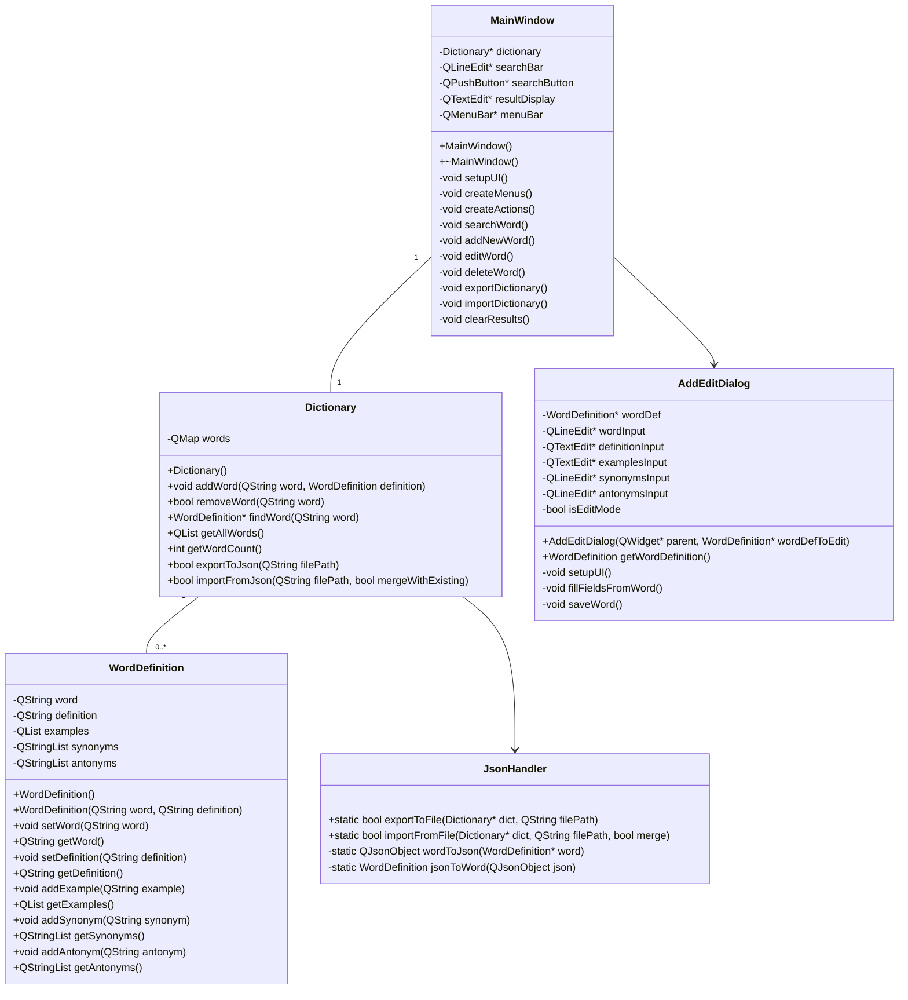

```mermaid
classDiagram
    class Dictionary {
        -QMap<QString, WordDefinition> words
        +Dictionary()
        +void addWord(QString word, WordDefinition definition)
        +bool removeWord(QString word)
        +WordDefinition* findWord(QString word)
        +QList<QString> getAllWords()
        +int getWordCount()
        +bool exportToJson(QString filePath)
        +bool importFromJson(QString filePath, bool mergeWithExisting)
    }
    
    class WordDefinition {
        -QString word
        -QString definition
        -QList<QString> examples
        -QStringList synonyms
        -QStringList antonyms
        +WordDefinition()
        +WordDefinition(QString word, QString definition)
        +void setWord(QString word)
        +QString getWord()
        +void setDefinition(QString definition)
        +QString getDefinition()
        +void addExample(QString example)
        +QList<QString> getExamples()
        +void addSynonym(QString synonym)
        +QStringList getSynonyms()
        +void addAntonym(QString antonym)
        +QStringList getAntonyms()
    }
    
    class MainWindow {
        -Dictionary* dictionary
        -QLineEdit* searchBar
        -QPushButton* searchButton
        -QTextEdit* resultDisplay
        -QMenuBar* menuBar
        +MainWindow()
        +~MainWindow()
        -void setupUI()
        -void createMenus()
        -void createActions()
        -void searchWord()
        -void addNewWord()
        -void editWord()
        -void deleteWord()
        -void exportDictionary()
        -void importDictionary()
        -void clearResults()
    }
    
    class AddEditDialog {
        -WordDefinition* wordDef
        -QLineEdit* wordInput
        -QTextEdit* definitionInput
        -QTextEdit* examplesInput
        -QLineEdit* synonymsInput
        -QLineEdit* antonymsInput
        -bool isEditMode
        +AddEditDialog(QWidget* parent, WordDefinition* wordDefToEdit)
        +WordDefinition getWordDefinition()
        -void setupUI()
        -void fillFieldsFromWord()
        -void saveWord()
    }
    
    class JsonHandler {
        +static bool exportToFile(Dictionary* dict, QString filePath)
        +static bool importFromFile(Dictionary* dict, QString filePath, bool merge)
        -static QJsonObject wordToJson(WordDefinition* word)
        -static WordDefinition jsonToWord(QJsonObject json)
    }

    Dictionary "1" -- "0..*" WordDefinition
    MainWindow "1" -- "1" Dictionary
    MainWindow --> AddEditDialog
    Dictionary --> JsonHandler
```