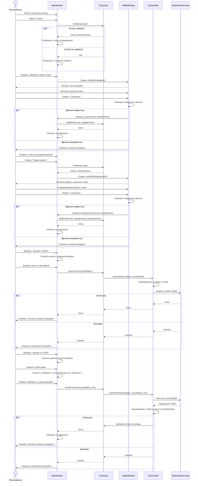

```mermaid
sequenceDiagram
    actor Пользователь
    participant UI as MainWindow
    participant Dict as Dictionary
    participant Dialog as AddEditDialog
    participant JSON as JsonHandler
    participant File as ФайловаяСистема

    %% Последовательность поиска слова
    Пользователь->>UI: Ввести слово для поиска
    Пользователь->>UI: Нажать "Поиск"
    UI->>Dict: findWord(слово)
    alt Слово найдено
        Dict-->>UI: Объект WordDefinition
        UI->>UI: Отобразить слово и определение
    else Слово не найдено
        Dict-->>UI: null
        UI->>UI: Отобразить "Слово не найдено"
    end

    %% Последовательность добавления нового слова
    Пользователь->>UI: Выбрать "Добавить новое слово"
    UI->>Dialog: Создать AddEditDialog(null)
    Dialog-->>Пользователь: Показать пустую форму
    Пользователь->>Dialog: Заполнить детали слова
    Пользователь->>Dialog: Нажать "Сохранить"
    Dialog->>Dialog: Проверить введенные данные
    alt Данные корректны
        Dialog->>UI: Вернуть новый объект WordDefinition
        UI->>Dict: addWord(слово, определение)
        Dict-->>UI: Успех
        UI->>UI: Обновить отображение
    else Данные некорректны
        Dialog->>Пользователь: Показать ошибки валидации
    end

    %% Последовательность редактирования слова
    Пользователь->>UI: Выбрать слово для редактирования
    Пользователь->>UI: Нажать "Редактировать"
    UI->>Dict: findWord(слово)
    Dict-->>UI: Объект WordDefinition
    UI->>Dialog: Создать AddEditDialog(wordDef)
    Dialog-->>Пользователь: Показать форму с данными слова
    Пользователь->>Dialog: Отредактировать детали слова
    Пользователь->>Dialog: Нажать "Сохранить"
    Dialog->>Dialog: Проверить введенные данные
    alt Данные корректны
        Dialog->>UI: Вернуть обновленный объект WordDefinition
        UI->>Dict: addWord(слово, определение) (перезаписать)
        Dict-->>UI: Успех
        UI->>UI: Обновить отображение
    else Данные некорректны
        Dialog->>Пользователь: Показать ошибки валидации
    end

    %% Последовательность экспорта словаря
    Пользователь->>UI: Выбрать "Экспорт в JSON"
    UI->>UI: Показать диалог сохранения файла
    Пользователь->>UI: Выбрать место и имя файла
    UI->>Dict: exportToJson(путьКФайлу)
    Dict->>JSON: exportToFile(словарь, путьКФайлу)
    JSON->>JSON: Преобразовать словарь в JSON
    JSON->>File: Записать JSON в файл
    alt Успешно
        File-->>JSON: Успех
        JSON-->>Dict: Успех
        Dict-->>UI: Успех
        UI->>Пользователь: Показать "Экспорт успешно завершен"
    else Ошибка
        File-->>JSON: Ошибка
        JSON-->>Dict: Ошибка
        Dict-->>UI: Ошибка
        UI->>Пользователь: Показать сообщение об ошибке
    end

    %% Последовательность импорта словаря
    Пользователь->>UI: Выбрать "Импорт из JSON"
    UI->>UI: Показать диалог открытия файла
    Пользователь->>UI: Выбрать JSON файл
    UI->>UI: Спросить "Добавить к существующим или заменить?"
    Пользователь->>UI: Выбрать "Добавить к существующим"
    UI->>Dict: importFromJson(путьКФайлу, true)
    Dict->>JSON: importFromFile(словарь, путьКФайлу, true)
    JSON->>File: Прочитать JSON файл
    File-->>JSON: Содержимое JSON
    JSON->>JSON: Преобразовать JSON в объекты WordDefinition
    alt Успешно
        JSON->>Dict: Добавить слова в словарь
        Dict-->>UI: Успех
        UI->>UI: Обновить отображение
        UI->>Пользователь: Показать "Импорт успешно завершен"
    else Ошибка
        JSON-->>Dict: Ошибка
        Dict-->>UI: Ошибка
        UI->>Пользователь: Показать сообщение об ошибке
    end
```