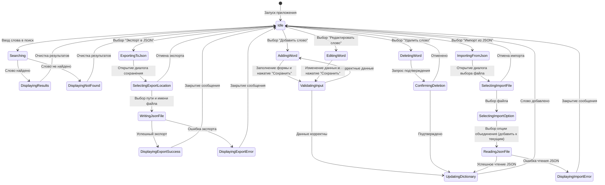

```mermaid
stateDiagram-v2
    [*] --> Idle: Запуск приложения
    
    Idle --> Searching: Ввод слова в поиск
    Searching --> DisplayingResults: Слово найдено
    Searching --> DisplayingNotFound: Слово не найдено
    DisplayingResults --> Idle: Очистка результатов
    DisplayingNotFound --> Idle: Очистка результатов
    
    Idle --> AddingWord: Выбор "Добавить слово"
    AddingWord --> ValidatingInput: Заполнение формы и нажатие "Сохранить"
    ValidatingInput --> AddingWord: Некорректные данные
    ValidatingInput --> UpdatingDictionary: Данные корректны
    UpdatingDictionary --> Idle: Слово добавлено
    
    Idle --> EditingWord: Выбор "Редактировать слово"
    EditingWord --> ValidatingInput: Изменение данных и нажатие "Сохранить"
    
    Idle --> DeletingWord: Выбор "Удалить слово"
    DeletingWord --> ConfirmingDeletion: Запрос подтверждения
    ConfirmingDeletion --> UpdatingDictionary: Подтверждено
    ConfirmingDeletion --> Idle: Отменено
    
    Idle --> ExportingToJson: Выбор "Экспорт в JSON"
    ExportingToJson --> SelectingExportLocation: Открытие диалога сохранения
    SelectingExportLocation --> WritingJsonFile: Выбор пути и имени файла
    SelectingExportLocation --> Idle: Отмена экспорта
    WritingJsonFile --> DisplayingExportSuccess: Успешный экспорт
    WritingJsonFile --> DisplayingExportError: Ошибка экспорта
    DisplayingExportSuccess --> Idle: Закрытие сообщения
    DisplayingExportError --> Idle: Закрытие сообщения
    
    Idle --> ImportingFromJson: Выбор "Импорт из JSON"
    ImportingFromJson --> SelectingImportFile: Открытие диалога выбора файла
    SelectingImportFile --> SelectingImportOption: Выбор файла
    SelectingImportFile --> Idle: Отмена импорта
    SelectingImportOption --> ReadingJsonFile: Выбор опции объединения (добавить к текущим)
    ReadingJsonFile --> UpdatingDictionary: Успешное чтение JSON
    ReadingJsonFile --> DisplayingImportError: Ошибка чтения JSON
    DisplayingImportError --> Idle: Закрытие сообщения
```